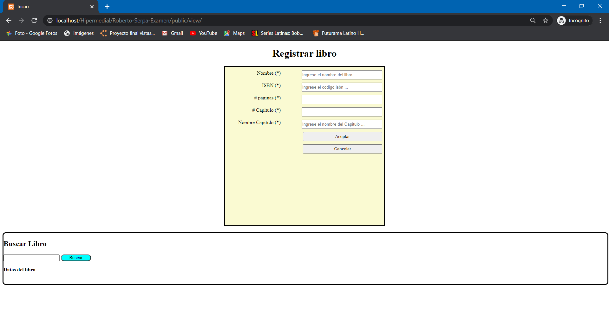
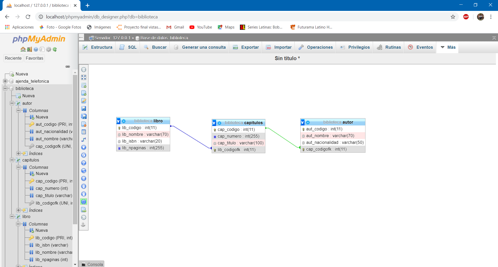
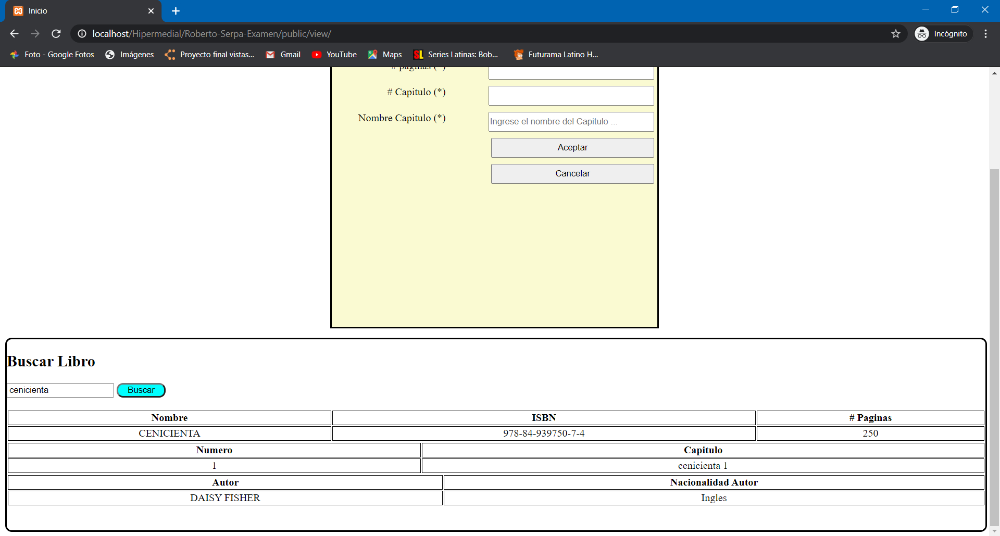
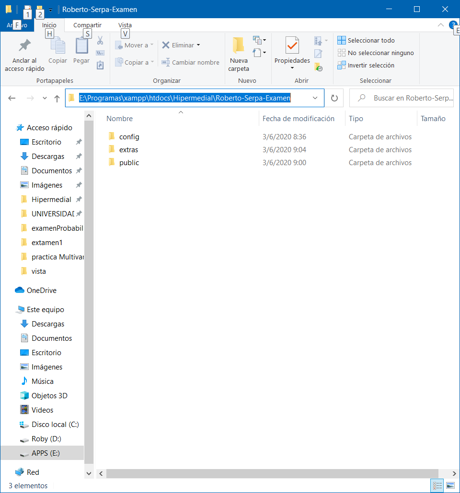

|  | **VICERRECTORADO DOCENTE** | **Código:** GUIA-PRL-001 |
| --- | --- | --- |
| CONSEJO ACADÉMICO | **Aprobación:** 2016/04/06 |
| **Formato:** Guía de Práctica de Laboratorio / Talleres / Centros de Simulación |

|  | **PRÁCTICA DE LABORATORIO** |
| --- | --- |
|
 |
| **CARRERA** : Computación | **ASIGNATURA** : Hipermedial |
| --- | --- |
| **NRO. PRÁCTICA** : |
 | **TÍTULO PRÁCTICA** : Examen Interciclo |
| --- | --- | --- |
| **OBJETIVO ALCANZADO:**
 |
| --- |
| **ACTIVIDADES DESARROLLADAS** |
| --- |
| **1.**  **Inicio de la página index.html**** Al momento de registrar un Libro se debe insertar los datos del Libro y Capítulo (debe permitir ingresar varios capítulos); además, se debe ingresar el código del autor para asociar al capítulo.**

  |
| --- |
| **2. Base de datos E R**![]

(RackMultipart20200603-4-o9qa02_html_a19e85c0c07cc57c.png) |
| --- |
| **3. Búsqueda por medio del nombre del libro**** Al momento de ingresar el código del autor y presionar en un botón &quot;Buscar Autor&quot; se deberá mostrar la información del autor extrayéndola de la base de datos, para lo cuál, deberá implementar funciones AJAX.**\&lt;?php     //incluir conexión a la base de datos     include &quot;conexionBD.php&quot;;         $texto = $\_GET[&#39;texto&#39;];     // aut\_nombre=&#39;$texto&#39; or cap\_titulo= $cap\_titulo    $sql = &quot;SELECT \* FROM libro WHERE (lib\_nombre=&#39;$texto&#39; )&quot;;         $result = $conn-\&gt;query($sql);
    echo &quot; \&lt;table class=&#39;misdatos&#39;&#39;\&gt;         \&lt;tr\&gt;             \&lt;th\&gt;Nombre\&lt;/th\&gt;            \&lt;th\&gt;ISBN\&lt;/th\&gt;            \&lt;th\&gt;# Paginas\&lt;/th\&gt;        \&lt;/tr\&gt;&quot;;     if ($result-\&gt;num\_rows \&gt; 0) {         while($row = $result-\&gt;fetch\_assoc()) {            $codigolib = $row[&quot;lib\_codigo&quot;];              echo &quot;\&lt;tr\&gt;&quot;;             echo &quot; \&lt;td\&gt;&quot; . $row[&quot;lib\_nombre&quot;] . &quot;\&lt;/td\&gt;&quot;;            echo &quot; \&lt;td\&gt;&quot; . $row[&#39;lib\_isbn&#39;] .&quot;\&lt;/td\&gt;&quot;;            echo &quot; \&lt;td\&gt;&quot; . $row[&#39;lib\_npaginas&#39;] . &quot;\&lt;/td\&gt;&quot;;        }     } else {         echo &quot;\&lt;tr\&gt;&quot;;         echo &quot; \&lt;td colspan=&#39;7&#39;\&gt; No existen libros registradas en el sistema \&lt;/td\&gt;&quot;;         echo &quot;\&lt;/tr\&gt;&quot;;     }         // echo &quot;\&lt;/table\&gt;&quot;;
    // $conn-\&gt;close();
                                 # Seccion de PHP donde se inserta los telefonos del usuario.    $sqlcap = &quot;SELECT \* FROM capitulos WHERE lib\_codigofk LIKE &#39;$codigolib&#39;&quot;;    $capitulos = $conn-\&gt;query($sqlcap);
    echo &quot; \&lt;table class=&#39;misdatos&#39;&#39;\&gt;         \&lt;tr\&gt;             \&lt;th\&gt;Numero\&lt;/th\&gt;            \&lt;th\&gt;Capitulo\&lt;/th\&gt;        \&lt;/tr\&gt;&quot;;
    if ($capitulos-\&gt;num\_rows \&gt; 0) {        while ($row = $capitulos-\&gt;fetch\_assoc()) {            $codigoaut = $row[&quot;cap\_codigo&quot;];              echo &quot;\&lt;tr\&gt;&quot;;            echo &quot; \&lt;td\&gt;&quot; . $row[&#39;cap\_numero&#39;] .&quot;\&lt;/td\&gt;&quot;;            echo &quot; \&lt;td\&gt;&quot; . $row[&#39;cap\_titulo&#39;] . &quot;\&lt;/td\&gt;&quot;;            echo &quot;\&lt;/tr\&gt;&quot;;        }    } else {        echo &quot;\&lt;tr\&gt;&quot;;        echo &quot; \&lt;td colspan=&#39;2&#39;\&gt; No existen capitulos registrados en ese usuario \&lt;/td\&gt;&quot;;        echo &quot;\&lt;/tr\&gt;&quot;;    }    echo &quot;\&lt;/table\&gt;&quot;;
    $sqlaut = &quot;SELECT \* FROM autor WHERE cap\_codigofk LIKE &#39;$codigoaut&#39;&quot;;    $autor = $conn-\&gt;query($sqlaut);
    echo &quot; \&lt;table class=&#39;misdatos&#39;&#39;\&gt;         \&lt;tr\&gt;             \&lt;th\&gt;Autor\&lt;/th\&gt;            \&lt;th\&gt;Nacionalidad Autor\&lt;/th\&gt;        \&lt;/tr\&gt;&quot;;
    if ($autor-\&gt;num\_rows \&gt; 0) {        while ($row = $autor-\&gt;fetch\_assoc()) {            echo &quot;\&lt;tr\&gt;&quot;;            echo &quot; \&lt;td\&gt;&quot; . $row[&#39;aut\_nombre&#39;] .&quot;\&lt;/td\&gt;&quot;;            echo &quot; \&lt;td\&gt;&quot; . $row[&#39;aut\_nacionalidad&#39;] . &quot;\&lt;/td\&gt;&quot;;            echo &quot;\&lt;/tr\&gt;&quot;;        }    } else {        echo &quot;\&lt;tr\&gt;&quot;;        echo &quot; \&lt;td colspan=&#39;2&#39;\&gt; No existen autores registrados en ese usuario \&lt;/td\&gt;&quot;;        echo &quot;\&lt;/tr\&gt;&quot;;    }    echo &quot;\&lt;/table\&gt;&quot;;

    echo &quot;\&lt;/table\&gt;&quot;;
    $conn-\&gt;close(); ?\&gt;

**Al momento de listar los Libros se debe visualizar la información del Libro, Capítulos y Autores. Los códigos no deben ser visualizados.**

  |
| --- |
| **4.** **Crear una carpeta dentro del servidor apache (htdocs) e identificarla con sus nombres completos, en el siguiente formato: **_ **Apellidos-Nombre-Examen. ** _ **Por ejemplo: LeonParedes-Gabriel-Examen.**![]

(RackMultipart20200603-4-o9qa02_html_c90ee60b6949e610.png) |
| --- |
| **N.** |
| --- |
|
 |
| --- |
| **RESULTADO(S) OBTENIDO(S)**:Resolución del examen
 |
| --- |
| **CONCLUSIONES** :Examen no completado |
| --- |
| **RECOMENDACIONES** :Revisar imágenes y el github |
| --- |

_ **Nombre de estudiante** _ **: Roberto Serpa**

_ **Firma de estudiante** _ **:**

**Resolución CS N° 076-04-2016-04-20**